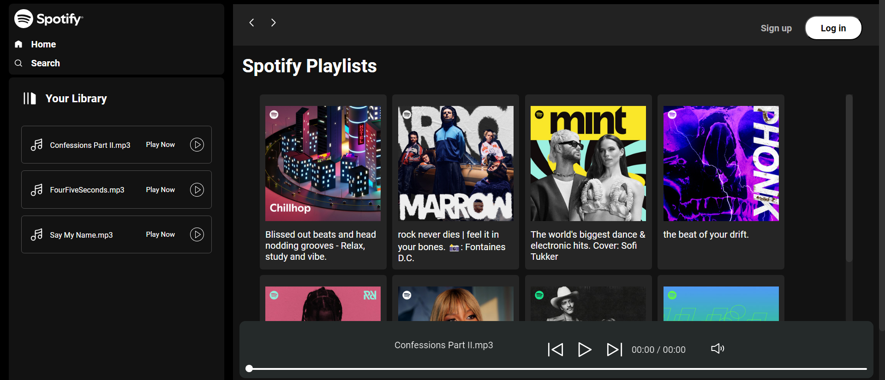
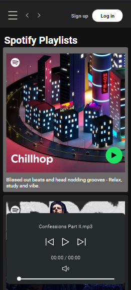

# Spotify Clone

This repository contains the source code for a Spotify clone built using HTML, CSS, and JavaScript. The project aims to replicate the basic UI and functionality of Spotify's web player, providing a responsive and interactive user experience.

## Live Demo

Check out the live demo of the project [here](https://spotifybyrushal.freewebhostmost.com/).

## Features

- **Responsive Design**: The website is fully responsive and works seamlessly on various devices and screen sizes.
- **Interactive UI**: Features an interactive user interface with navigation menus, a play/pause button, and volume controls.
- **Modern Technologies**: Built with modern web technologies including HTML5, CSS3, and JavaScript.

## Screenshots

  

